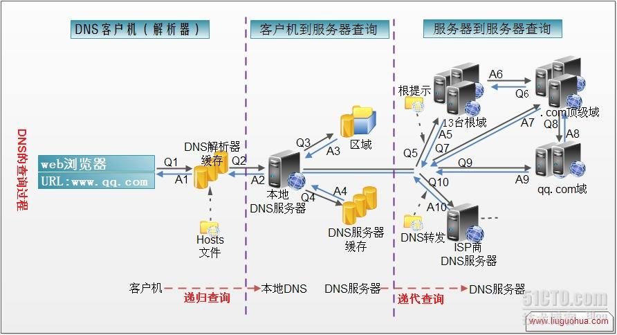

# DNS 原理及查询过程

计算机只能识别 ip 地址，而人类大部分并不能记住 ip 地址，dns 服务器就起到翻译的作用。

### DNS 分 5 个级别

1.  根域(.)
2.  顶级域(.com .edu 等)
3.  第二层域( baidu.com qq.com)
4.  子域(www. beta. )
5.  主机名(test.www.)

### DNS 请求的过程

1.  在浏览器中输入一个域名，操作系统会先检查自己本地的 hosts 文件是否有这个网址映射关系，如果有，就先调用这个 IP 地址映射，完成域名解析。

2.  如果 hosts 里没有这个域名的映射，则查找本地 DNS 解析器缓存，是否有这个网址映射关系，如果有，直接返回，完成域名解析。

3.  如果 hosts 与本地 DNS 解析器缓存都没有相应的网址映射关系，首先会找 TCP/ip 参数中设置的首选 DNS 服务器，如果有，则返回解析结果给客户机，完成域名解析。

4.  如果要查询的域名，不由本地 DNS 服务器区域解析，但该服务器已缓存了此网址映射关系，则调用这个 IP 地址映射，完成域名解析，此解析不具有权威性。

5.  如果本地 DNS 服务器本地区域文件与缓存解析都失效，则根据本地 DNS 服务器的设置（是否设置转发器）进行查询，如果未用转发模式，本地 DNS 就把请求发至 13 台根 DNS，根 DNS 服务器收到请求后会判断这个域名(.com)是谁来授权管理，并会返回一个负责该顶级域名服务器的一个 IP。本地 DNS 服务器收到 IP 信息后，将会联系负责 .com 域的这台服务器。这台负责 .com 域的服务器收到请求后，如果自己无法解析，它就会找一个管理 .com 域的下一级 DNS 服务器地址给本地 DNS 服务器。当本地 DNS 服务器收到这个地址后，就会找顶级域服务器，重复上面的动作，进行查询，直至找到相应域名主机。

6.  如果用的是转发模式，此 DNS 服务器就会把请求转发至上一级 DNS 服务器，由上一级服务器进行解析，上一级服务器如果不能解析，或找根 DNS 或把转请求转至上上级，以此循环。不管是本地 DNS 服务器用是是转发，还是根提示，最后都是把结果返回给本地 DNS 服务器，由此 DNS 服务器再返回给客户机。

7.  从客户端到本地 DNS 服务器是属于递归查询，而 DNS 服务器之间就是的交互查询就是迭代查询。

### DNS 劫持

1.  域名劫持往往只能在特定的被劫持的网络范围内进行，所以在此范围外的域名服务器(DNS)能够返回正常的 IP 地址，可以设置把 DNS 指向这些正常的域名服务器以实现对网址的正常访问。
2.  域名劫持通常相伴的措施——封锁正常 DNS 的 IP。如果知道该域名的真实 IP 地址，则可以直接用此 IP 代替域名后进行访问。
3.  DNS  劫持一般修改路由 ，引到错误的 DNS 服务器
