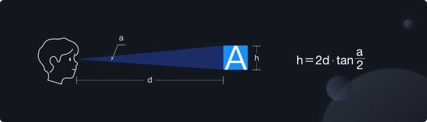
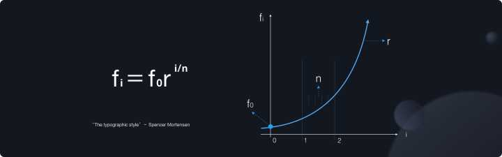
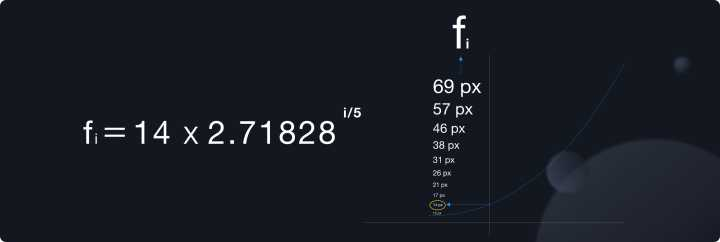
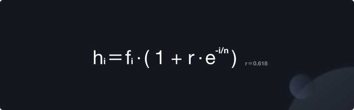
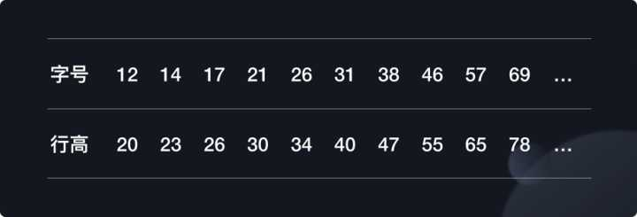

# 主字号、字阶和行高

1. 多大的主字号是自然的？

   

   肉眼到物体之间的距离，物体的高度以及这个三角形的角度，构成了一个三角函数的关系。而公式中的 h 的值和我们要解决的核心问题『主字号』有着很大的关系。关于这个 a 的角度，有机构和团队做过研究，当大于 0.3 度时的阅读效率是最好的。同时我们在操作电脑时，一般来说眼睛距离电脑屏幕的平均值大概会在 50 厘米左右。然而，公式中的距离和高度的单位都是厘米，字体的单位是 pixel。因此我们还需要将二者之间做一轮转换，完成转换所需的两个数值分别是 2.45（cm 到 inch）和 PPI（inch 到 pixel）。

   假定 PPI 为 120。通过计算便可以得出在显示器的 PPI 为 120 的情况下，理论上大于 12px 的字体能够满足用户的最佳阅读效率。基于这样的思路，确定主流 PPI 的范围，就很容易锁定主字体的大小了。根据网络上的数据来源，我们发现只有大约 37.6% 的显示器 PPI 是小于 120 的，而 PPI 在 120－140 的显示器的占比大约为 40%。换句话说 12px 的字体只能满足 37.6% 用户的阅读体验，但如果我们将字体放大到 14px，就可以保证大约 77% 的显示器用户处于比较好的阅读体验。因此在 3.0 我们将主字号进行了升级，从原本的 12px 调整至 14px。

2. 自然的字阶?

   
   

3. 多大的行高是自然的？

   * 设计师希望字体高度和行高之间能从静态黄金比出发

   - 基于设计经验，同时不给布局造成压力，我们希望行高的增长速度能够随着字体的增长逐渐趋向于缓慢，并且最终不要超过 1 倍

   
   

   * 所有的字体以及行高都符合偶数原则，并且行高和字体之间都相差 8，更加便于记忆。
